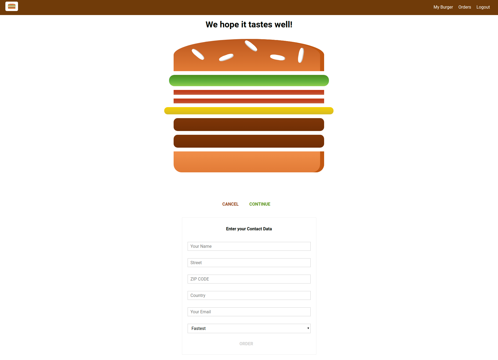
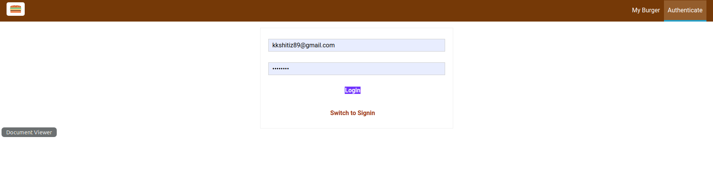
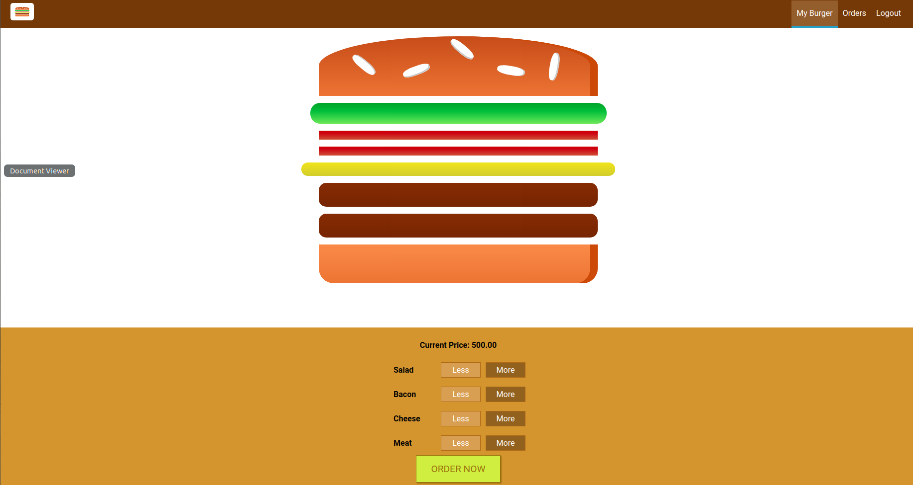
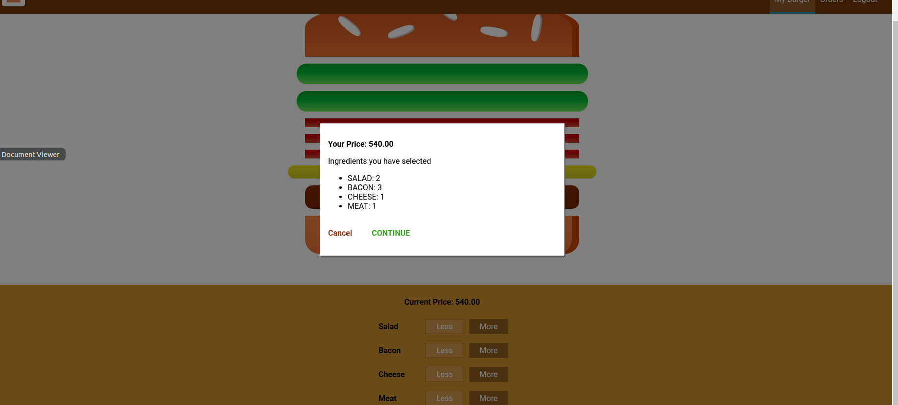

# Burger-builder-by-react ([Link](https://my-burger-builder-fbc31.web.app/))
React app for creating and ordering a burger managed by redux management system

# Functionality
- user can create account by clicking authenticate tab (firebase authentication).
- user can select ingredients to be added in the burger
- user can order by filling appropriate form.

# DEMO


---


---


---


---
# Tech Used
- Reactjs
- React-Redux
- React-Router
- Firebase authentication
- Firebase database

# Steps
```bash
npm install (nodejs should be installed)
npm start
```
